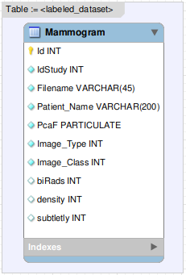

**WARNING: WebHigiia is NOT clinical software. It was designed for education and demonstration purposes ONLY!**

# WebHigiia Modeling Guide
## _Model your image dataset with examples_

WebHigiia relies on a set of reserved tables and attributes for mapping dataset entries in a _framework_-like environment. Therefore, those tables must be created once in the server-side of the CBMIR application ([SIREN][siren]) before you start any WebHigiia client. 

A simple telnet connection (`telnet <siren-ip> <siren-port>`) allows you to feed the script to the server-side. The default creation script is available [here][higiiaddl], and the relational representation of the tables are as follows:


- Table Login: For users and passwords (will be deprecated when QSsl gets supported by Emscripten).
- Table Pool: Associates query images with users.
- Scope: Defines the attributes of interest targeted by the CBMIR application (including labeling and visual mining).
- Caption: Provides a textual explanation for the Scope attributes.

**NOTE:** Both `Scope` and `Pool` Tables can be linked with your underlying DBMS data dictionary with foreign key constraints to ensure full consistency of the model (you still can use the client without that, though). Such constraints are not represented here for simplification purposes.

## Setting up WebHigiia - The Mammogram example

**WebHigiia is a domainless tool** for any medical image domain of CT, RX, or other study types. To illustrate the application capabilities, let's set up WebHigiia as a Content-Based Medical Image Retrieval tool for mammograms.

## Loading a dataset

In this example, we will configure WebHigiia to query an [excerpt (05 images)][mammo] of a [public dataset][mammoset], which can be straightforwardly translated into a relational representation.



> Attributes {`Id`, `IdStudy`, `Filename`, `Patient_Name`, `Image_Type`, `Image_Class`, `Mask`} are **reserved** and **mandatory** for any dataset modeled after WIA. Besides, at least one PARTICULATE attribute is expected to be found in the dataset-based table. WIA can't issue queries over datasets without those attributes.

This table representation can be created on the SIREN server by using extended SQL (through a simple telnet connection), as follows:

```sql
CREATE TABLE Mammogram (
    Id INTEGER, 
    IdStudy INTEGER, 
    Filename VARCHAR(255),
    Patient_Name VARCHAR (300),
    PcaF PARTICULATE (3),
    Image_Type VARCHAR(45),
    Image_Class VARCHAR(45),
    biRads INTEGER,
    density INTEGER,
    subtletly INTEGER,
    PRIMARY KEY (Id), 
    METRIC (PcaF) USING (L2, L1, CANBERRA) 
);
```

While the syntax is standard SQL for the most part, the constraint `METRIC` defines the distance functions associated with the `PARTICULATE` (3-dimensional) `PcaF` attribute: `L1, L2, CANBERRA`. Those metrics must be previously created by the [WebHigiia instantiation script][higiiaddl].

Attributes {`biRads`, `density`, `subtlety`} are optional values that we can set WebHigiia to focus on (labeling, etc.). For instance, `biRads` is a consolidated [ACR-NEMA descriptor][birads] for mammograms that scales from `0` to `6`. Therefore, we can set WebHigiia to keep `biRads` as a **search scope** for the `Mammogram` table with a SQL insert into the WebHigiia internal table.

```sql
INSERT INTO Scope VALUES ('Mammogram', 'Image_Class');
INSERT INTO Scope VALUES ('Mammogram', 'Image_Type');
INSERT INTO Scope VALUES ('Mammogram', 'biRads');
```

Additionally, we can set WebHigiia to provide proper subtitling for the scope attribute by populating its internal Caption table with inserts regarding the `biRads` attribute.

```sql
-- Don't use comma in the captions!
INSERT INTO Caption VALUES ('Mammogram', 'biRads', '0', 'Incomplete.');
INSERT INTO Caption VALUES ('Mammogram', 'biRads', '1', 'Negative.');
INSERT INTO Caption VALUES ('Mammogram', 'biRads', '2', 'Benign - P-0% malignancy.');
INSERT INTO Caption VALUES ('Mammogram', 'biRads', '3', 'Benign - P<2% malignancy.');
INSERT INTO Caption VALUES ('Mammogram', 'biRads', '4', 'Malignancy - P<2-94% malignancy.');
INSERT INTO Caption VALUES ('Mammogram', 'biRads', '5', 'Malignancy - P>95% malignancy.');
INSERT INTO Caption VALUES ('Mammogram', 'biRads', '6', 'Malignancy - biopsy-proven.');
```


After the table creation and scope definition, we can insert dataset elements with extended SQL commands. You can compute the multidimensional features for each dataset entry outside WebHigiia (by using your favorite programing language and framework) and then wrap it up with an insertion script.

Assuming the `PcaF` features have already been extracted in our example, the insertion of the [dataset excerpt][mammo] is carried out by the following extended SQL commands:

```sql
INSERT INTO Mammogram (Id,  IdStudy,  Filename, Patient_Name, PcaF, Image_Type, Image_Class, biRads, density, subtletly)  
                      VALUES (19, 1, 'mammo/usf0019_LCC_L1_MS_B.jpg', 'Patient 1', {0.01, 0.02, 0.03}, 'left craniocaudal', 'Mass', 2, 2, 4);
INSERT INTO Mammogram (Id,  IdStudy,  Filename, Patient_Name, PcaF, Image_Type, Image_Class, biRads, density, subtletly) 
                      VALUES (3, 1, 'mammo/usf0003_RCC_L1_MS_M.jpg', 'Patient 2', {0.53, 0.61, 0.42}, 'right craniocaudal', 'Mass', 6, 2, 5);
INSERT INTO Mammogram (Id,  IdStudy,  Filename, Patient_Name, PcaF, Image_Type, Image_Class, biRads, density, subtletly) 
                      VALUES (2, 1, 'mammo/usf0002_LMLO_L1_CL_M.jpg', 'Patient 3', {0.78, 0.79, 0.33}, 'left  mediolateral oblique', 'Calcification', 0, 2, 4);
INSERT INTO Mammogram (Id,  IdStudy,  Filename, Patient_Name, PcaF, Image_Type, Image_Class, biRads, density, subtletly) 
                      VALUES (1, 1, 'mammo/usf0001_RMLO_L1_MS_M.jpg', 'Patient 4', {0.49, 0.47, 0.38}, 'right  mediolateral oblique', 'Mass', 6, 3, 4);
INSERT INTO Mammogram (Id,  IdStudy,  Filename, Patient_Name, PcaF, Image_Type, Image_Class, biRads, density, subtletly) 
                      VALUES (7, 1, 'mammo/usf0007_RCC_L1_MS_M.jpg', 'Patient 5', {0.55, 0.49, 0.37}, 'right craniocauda', 'Mass', 6, 2, 5);
```

> Mask attribures are optional. They are compacted as base64 strings and inserted as BLOBs into the relational DBMS. If you want to understand how they are generated, please check this [GitHub entry](https://github.com/marcosivni/SlugfyBinaryMask/).

> **NOTE:** Remember copying the image files to the `fs` directory of the [Websocketfy-Server](https://github.com/marcosivni/websocketfy#generating-the-binary). 

> After the insertion of dataset elements, WIA can query images by content (following the multidimensional features and the user-defined metrics). Nevertheless, we must assign the query images (potentially undiagnosed entries) to the users that can access them.

## Prepare for querying

While queries can be issued to the server counterpart (SIREN) through extended SQL, WebHigiia requires the loading of (potentially undiagnosed) query images into a proper 'query pool' as well as granting users the permission to access them.

The set of query images must be loaded in a separated table named with the prefix `U_`. In the mammogram dataset example, this table is `U_Mammogram` and contains all reserved and mandatory attributes of table `Mammogram` plus the `PARTICULATE` attributes employed for mapping the space of features. Therefore, the SQL representation of table `U_Mammogram` is as follows.


```sql
CREATE TABLE U_Mammogram (
    Id INTEGER, 
    IdStudy INTEGER, 
    Filename VARCHAR(255),
    Patient_Name VARCHAR (300),
    PcaF PARTICULATE (3),
    Image_Type VARCHAR(45),
    Image_Class VARCHAR(45),
    url VARCHAR(300),
    PRIMARY KEY (Id), 
    METRIC (PcaF) USING (L2, L1, CANBERRA) 
);
```

> Attribute {`url`} is **reserved** and **mandatory**. It connects the query image with other HIS systems with link sharing support, such as external PACS-Viewers.

After the table creation, we can populate it with query images, such as [this entry/example][oq].

```sql
INSERT INTO U_Mammogram VALUES (1, 2, 'mammo/query_example_2.krl', 'Patient X', {0.57, 0.53, 0.47}, "", NULL, NULL);
```

Next, we must include the query image in a user-associated pool with an  `INSERT INTO` in WebHigiia internal tables, as follows.

```sql
-- If the user is not defined then create one (will be replaced by QSsl in near future)
INSERT INTO Login VALUES (1, 'UserNick', 'UserPass');
-- Insert a pool entry for the user and the query image
INSERT INTO Pool VALUES (1, 1, 'U_Mammogram');
```

WebHigiia is now ready to query the mammogram dataset.

## Querying a dataset

Upon entering into the system, WebHigiia loads the pool of query images so that the user can select one case and proceed. Next, the query parameters must be defined. Some important points to take note of:

1. *Similarity Parameters*
- Search Type:
- `Similarity Search`: Executes a [classical and indexed *k*-Nearest Neighbor search][hetland].
- `Diversity Search`: Executes a fast [diversified][drosou] *k*-Nearest Neighbor search with [BRID][jasbick].
- `Bridged Similarity Search`: Executes a diversified *k*-Nearest Neighbor search by grouping non-diversified elements with [BridGE][santos].
- Similarity Attribute: Indicates the `PARTICULATE` attribute employed for the building of the search space.
- Distance function: Indicates the search metric.
- Relevance Feedback: Indicates the name of the Relevance Feedback method employed for query refinements.
- Neighbors: The number of retrieved elements.
- Max group size: The maximum number of clustered elements (Diversity and Bridged queries-only).

2. `Scope` attributes can be used for filtering the content-based retrieval query. They are listed within the search ''Hypothesis'' combo-box.

3. Minimum and maximum values for `Scope` attributes in the *Search Parameters* tab.

4. `Scope` attributes limit the search space, which means they filter the search space **before** the execution of the similarity search. Thus, the content-based retrieval will always follow the restrictions posed on `Scope` attributes.
 
5. An *Analytics query* presents a spatial search space exploration with a 2D plot containing the result of a `Bridged Similarity Search`. It also provides the automatic labeling of the query image regarding `Scope` attributes and presents the statistics for the grouped elements.

6. A Content-Based Medical Image Retrieval query returns the result set in a Picture Archiving and Communication System (PACS)-like Viewer with windowing, zooming, and navigation tools. Depending on the search type, the following features are available.

7. `Similarity Search` and `Diversity Search` features
- Putting the mouse upon an image of the result set enables the visualization of the annotation related to that specific result.
- Double-clicking brings the image from the result set to the center of the window.
- At the center of the window, the user can employ a high-contrast windowing operation for better visualization.
- Left-click triggers the exclusion of an image in the result set that is not relevant.
- Right-click enables you to mark an image in the result set as relevant.
- After labeling relevant and non-relevant images, you may request Rocchio-based relevance feedback cycles to explore other similar images.

8. `Bridged Similarity Search` features
- The representative images from strong influence sets are displayed on the right.
- Right-click expands and collapses a strong influence set.
- The list of representatives enables a result exploration from a diversity perspective, whereas the influence sets are kept sorted by similarity. Therefore, you can shift the exploration perspective from diversity to similarity.
- If an image is labeled as relevant, it is permanently kept in the "My List of Relevant Images" until you explicitly remove it.
- Images of strong influence sets can be dismissed with left-clicks. The entire influence set is dismissed if you discard the representative.
- Images labeled as relevant are kept in the "My List of Relevant Images".
- Diversified relevance feedback cycles shift the positioning of the query element by using the size of strong influence sets as another weight in the Rocchio-based relevant feedback algorithm.
- The retrieved images in the result set can be compared to others previously included in the "My List of Relevant Images".


## Query examples - Results and Background

The most basic query we can execute over our example of the `Mammogram` dataset is a `Similarity Search` with **unrestricted search scope**. This query configuration requires using the *default* query parameterization with search hypothesis set to `NONE` and the search Type set to `Similarity Search` with a value *k* > 0. For instance, the query for *k = 3* nearest neighbors of our example (*'mammo/query_example_2.krl'*) retrieves the following images:


The result is a visual representation for the result set generated by the following extended SQL query performed by server counterpart SIREN.

```sql
-- Image_Class, Image_Type, and biRads are previously defined 'Scope' attributes   
SELECT Mammogram.biRads, Mammogram.Image_Class, 
       Mammogram.Image_Type, Mammogram.Filename Filename, 
       Mammogram.Id Id 
FROM Mammogram 
WHERE Mammogram.PcaF NEAR  {0.57, 0.53, 0.47} 
      BY L2 STOP AFTER 3 
ORDER BY (Mammogram.Id);
```

After the exploration of the result set, the expert may select relevant (green border images) and non-relevant objects (left-click excluded images) and perform a relevance-feedback cycle. The following figure presents the result of a relevance feedback cycle *k = 2* neighbors.


This result was obtained with the following extended SQL query.

```sql
-- Image_Class, Image_Type, and biRads are previously defined 'Scope' attributes   
SELECT Mammogram.biRads, Mammogram.Image_Class, 
       Mammogram.Image_Type, Mammogram.Filename Filename, 
       Mammogram.Id Id 
FROM Mammogram 
WHERE Mammogram.PcaF NEAR  {0.54, 0.535, 0.435} 
      BY L2 STOP AFTER 3 
ORDER BY (Mammogram.Id);
```

> The Rocchio relevance feedback method ''sifts'' the query element in the search space according to relevant and non-relevant neighbors. In the example, it went from (0.57, 0.53, 0.47) to (0.54, 0.535, 0.435).

A variant of the first query would be retrieving up to *three* neighbors to the query element (*'mammo/query_example_2.krl'*) with *biRads = 2* (Benign), which would filter the search space towards a proper `Scope` attribute. The result for this search is presented below. Please, notice we loaded only five images, one having *biRads = 2*.


As in the previous case, this result was generated by the following extended SQL query statement.

```sql
-- Image_Class, Image_Type, and biRads are previously defined 'Scope' attributes   
SELECT temp.biRads, temp.Image_Class, 
       temp.Image_Type, temp.Filename Filename, 
       temp.Id Id 
FROM (  
        SELECT * 
        FROM Mammogram 
        WHERE Mammogram.biRads >= 2 AND Mammogram.biRads <= 2 
     ) AS temp  
WHERE temp.PcaF NEAR {0.57, 0.53, 0.47} 
      BY L2 STOP AFTER 3 
ORDER BY (temp.Id);
```

Result sets with images *too* similar may lead to burdensome and repeated relevance feedback cycles. Thus a query criterion with a more *exploratory nature* may be preferred in those cases. WebHigiia provides the `Diversity Search` and `Bridged Similarity Search` alternatives for such scenarios. `Diversity Search` result sets retrieves up to *k* neighbors diversified among themselves. Those neighbors are also called [*influencers*][brid] in the search space regarding the viewpoint of the query object.

In the mammogram example, a search for up to *k = 5* diversified and nearest neighbors of the query element (*'mammo/query_example_2.krl'*)  returns a result with only *four* images as follows. Why is that? Because one neighbor is also similar to a result set entry that is closer to the query object. Therefore, this candidate was discarded from the result set. (**NOTE**: the dataset contains only five entries).


While the semantics of the search is distinct from the previous cases, it can still be solved through an extended SQL command, as follows.

```sql
-- Image_Class, Image_Type, and biRads are previously defined 'Scope' attributes   
SELECT Mammogram.biRads, Mammogram.Image_Class, 
       Mammogram.Image_Type, Mammogram.Filename Filename, 
       Mammogram.Id Id 
FROM Mammogram 
WHERE Mammogram.PcaF DIVERSITY NEAR {0.57, 0.53, 0.47} 
      BY L2 STOP AFTER 5 
ORDER BY (Mammogram.Id); 
```

Finally, the `Bridged Similarity Search` enables the retrieval of neighbors that are either *influencer objects* (*i.e.*, outside the range of 'too similar' for any entry the result set) or *influenced objects* (*i.e.*, within the range of 'too similar' to a result set entry). In other words, it also retrieves the elements discarded by the `Diversity Search`. The answer is presented hierarchically, in which *influenced objects* are placed below the *influencer images*. Therefore, the result set may contain *more* than *k* diversified and nearest neighbors.

For instance, the search for up to *k = 5* diversified and nearest neighbors of the query element (*'mammo/query_example_2.krl'*) with `Bridged Similarity Search` returns *five* entries, being one element influenced by a result set entry (See Figure below).


This result set was obtained by the following extended SQL command.

```sql
-- Image_Class, Image_Type, and biRads are previously defined 'Scope' attributes   
SELECT Mammogram.biRads, Mammogram.Image_Class, 
       Mammogram.Image_Type, Mammogram.Filename Filename, 
       Mammogram.Id Id 
FROM Mammogram 
WHERE Mammogram.PcaF DIVERSIFIED NEAR {0.57, 0.53, 0.47} 
      BY L2 STOP AFTER 5 BRIDGE 2
ORDER BY (Mammogram.Id); 
```

> Bridged queries employ a second parameter (Maximum number of grouped elements) to prune the size of a result set. Therefore, the maximum cardinality expected for such queries is (number of neighbors x maximum number of grouped elements).

## Analytics - Results and Background

Another feature provided by WebHigiia is the Analytical interface. It is also based on the search image and uses a distance-based classifier and the search criteria to label `Scope` attributes, provides statistics and describes the search space. The next figure presents WebHigiia Analytics for a `Bridged Similarity Search` over the dataset example of mammogram for *k=5* neighbors and groups of *5* elements.


The query representations are provided as 2D plots in which *influencers* are depicted as points through a PCA dimensionality reduction]. *Influenced objects* are spirally placed around *influencers* based on the distances among them. Users can click on a cluster to check the *influencer* thumbnail, the group statistics regarding inner distances, and the `Scope` attributes. From that visualization point, users can:

- Explore the search space regarding any particular `Scope` value by just selecting the attribute of interest,
- Explore faster the search space for non-expected `Scope` values and a larger number of neighbors,
- Verify the distance-labeling output for `Scope` attributes as well as their related statistics,
- Easily expand grouped elements into a PACS-like Viewer interface to navigate among clustered objects, and
- Start a new adjusted search without the need for a relevant feedback cycle.

The **glossary** for WebHigiia Analytics are as follows:

| Term | Meaning |
| ------ | ------ |
| Visual mining target | `Scope` attribute of interest. |
| Average distance | Average L2 distance between points within the PCA projection. |
| Density | Number of elements grouped under an *influencer*. |
| Local Density | Percentual value of grouped elements regarding the total number of clustered elements. |
| Global Density | Percentual value o local grouped elements regarding other groups. |


## Notes

- WebHigiia is NOT clinical software. **It is built for education and demonstration purposes ONLY!**
- Images of the example in this guide are available at dir /model/example/data/mammo/
- If you want to modify the client, feel free to fork the project.
- _(C) THIS SOFTWARE IS PROVIDED ``AS IS'' AND ANY EXPRESSED OR IMPLIED WARRANTIES, INCLUDING, BUT NOT LIMITED TO, THE IMPLIED WARRANTIES OF MERCHANTABILITY AND FITNESS FOR A PARTICULAR PURPOSE ARE DISCLAIMED.  IN NO EVENT SHALL THE AUTHORS OF THIS SOFTWARE OR ITS CONTRIBUTORS BE LIABLE FOR ANY DIRECT, INDIRECT, INCIDENTAL, SPECIAL, EXEMPLARY, OR CONSEQUENTIAL DAMAGES (INCLUDING, BUT NOT LIMITED TO, PROCUREMENT OF SUBSTITUTE GOODS OR SERVICES; LOSS OF USE, DATA, OR PROFITS; OR BUSINESS INTERRUPTION) HOWEVER CAUSED AND ON ANY THEORY OF LIABILITY, WHETHER IN CONTRACT, STRICT LIABILITY, OR TORT (INCLUDING NEGLIGENCE OR OTHERWISE) ARISING IN ANY WAY OUT OF THE USE OF THIS SOFTWARE, EVEN IF ADVISED OF THE POSSIBILITY OF SUCH DAMAGE._


[//]: # (These are reference links used in the body of this note and get stripped out when the markdown processor does its job. There is no need to format nicely because it shouldn't be seen. Thanks SO - http://stackoverflow.com/questions/4823468/store-comments-in-markdown-syntax)

   [siren]: <https://github.com/marcosivni/siren>
   [higiiaddl]: <https://github.com/marcosivni/webhigiia/blob/main/model/WebHigiia_DDL.sql>
   [mammo]: <example/data/mammo>
   [oq]: <example/data/mammo/query_example_2.krl>
   [hetland]: <https://citeseerx.ist.psu.edu/viewdoc/download?doi=10.1.1.216.5538&rep=rep1&type=pdf>
   [drosou]: <https://www.cs.drexel.edu/~julia/documents/big.2016.0054.pdf>
   [jasbick]: <https://link.springer.com/chapter/10.1007/978-3-030-60936-8_11>
   [santos]: <https://ieeexplore.ieee.org/abstract/document/6881893>
   [kundaha]: <https://github.com/marcosivni/kundaha>
   [brid]: <https://www.researchgate.net/profile/Lucio-Dutra-Santos/publication/262253340_Parameter-free_and_domain-independent_similarity_search_with_diversity/links/5ca4aea4299bf1b86d61d045/Parameter-free-and-domain-independent-similarity-search-with-diversity.pdf>
   [agg]: <https://eprints.ukh.ac.id/id/eprint/186/1/2015_Book_DataMining.pdf>
   [mammoset]: <https://bitbucket.org/gbdi/mammoset/src/master/>
   [birads]: <https://www.acr.org/Clinical-Resources/Reporting-and-Data-Systems/Bi-Rads>
   
